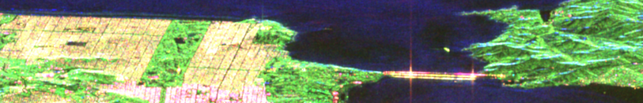

## Advanced practical sessions on Radar Polarimetry

This repository contains practical sessions offered at the ESA’s 7th Advanced Training Course on Radar Polarimetry which took place in Toulouse, France, June 12-16, 2023.

Since original data provided has outdated environemnt and a lot of unecessary and missing modules, the code here was cleaned and updated with a compact conda environment.

### Usage
For each of the days there are numbered theoretical materials and, if available, solutions to practical tasks in html format. 

*Environment file to the code will be added later.*

### Resources
[Official course website](https://polarimetrycourse2023.esa.int/)
[Official course materials](https://eo4society.esa.int/resources/7th-advanced-training-course-radar-polarimetry/)
[Official recordings of lectures](https://www.youtube.com/playlist?list=PLvT7fd9OiI9U2P1sZTfz2Hhc_H6qIVrXm)
